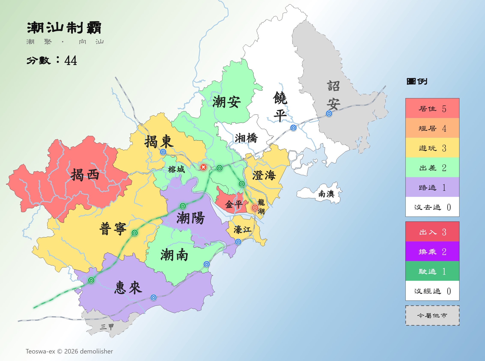

# 潮汕制霸

**在线体验**：[Netlify](https://teoswa-ex.netlify.app/) ｜ [Vercel](https://teoswa-ex.vercel.app/)

> **English**：**Teoswa-ex** is a footprint-map maker for the [Chaoshan](https://en.wikipedia.org/wiki/Chaoshan) region: click to mark where you have been [long-term resided / short-term lived / traveled / on a business trip / passed through], then export a PNG. The rest of this document is Chinese only; sorry for the inconvenience.

一句话简介：这是一个以县级行政区为基础标记单位的潮汕地区足迹地图生成器。

## 基础功能

- **制霸**：可分别制霸行政区/客运站点，详见「等级标准」，支持改档或取消；
- **计分**：实时累加所有制霸点分数，不设上下限；
- **重置**：慎用，会清空全部行政区与站点标记（八个开关的状态、控制面板抽屉的开合都不动）；
- **导出**：可将制霸结果保存成 PNG 图片，多端格式一致（图例只含等级和外市）；
- **多端适配**：随浏览器宽度自适应调整布局，当宽度 ≤820px 时自动切换为纵向布局，单指拖动、双指缩放、双击复位。

## 特色功能

- **可开关图层**：「内陆河流」与「对外客运设施」（铁路 + 站点）分设两个开关，默认关闭，可自定义开启；
- **客运站点信息**：三市全部客运火车站与揭阳潮汕国际机场（另含厦深铁路福建段的诏安站），鼠标悬停出信息卡，显示名称 + 属地 + 台线信息；
- **铁路切片点亮**：一条铁路区间的两端站都有标记，该区间就变绿泛光（机场两支与四条出界尾段由「铁路特例」开关单独控制）。
- **中间站点自动补「驶过」**：一条铁路区间的两端站都标了，中间站自动补成驶过（可按需手工重标「没经过」）；
- **站点抬县**：标记了站点，若其所在的县级行政区尚未制霸，自动补成「路过」，已手工选过的档位不动。

## 等级标准

### 行政区

- 居住 5：住过一年以上
- 短居 4：住过一个月以上
- 游玩 3：旅行过
- 出差 2：去过但因行动范围受限，完全没玩
- 路过 1：任意交通方式经过但未曾留步

### 客运站点

- 出入 3：在此站点有过进出站行为
- 换乘 2：在此**枢纽**客运站点进行过换线/空铁互转
- 驶过 1：坐火车经过此站但未下车

> 枢纽站点包括：汕头站、潮汕站、揭阳潮汕国际机场（揭阳机场站），仅此三站点可标记「换乘」。

## 地图说明

- 含潮汕三市 15 个县级行政区，以及今属邻市（外围）的 2 地，共 **17 个单位**，不设周边参照县市；
- 外围区域灰底虚线边，即使被标记上色也保留虚边以作区分；
- 地名标注采用短名，省略「（县级）市/区/县」；

## 字标字体说明

依作者个人喜好，界面文字全部采用台标正体（繁体），已默认用户都能看懂。其中，所有地名标签使用楷书，界面其他文字使用隶书，两款字体均来自教育部。界面文字用词习惯并未因为字标切换而改变，仍然保留大陆用词习惯。

## 常见问题

- 问：**标记内容会不会丢失？**  
  答：标记缓存在浏览器本地，同一浏览器同一部署链接下长期有效；换设备、换浏览器、换用其他部署链接以及「重置」都会导致丢失记录；
- 问：**怎么分享自己的制霸结果？**  
  答：请用「保存成图片」导出的 PNG；手机端可能需要长按保存，但实测 Via 可正常弹出下载；
- 问：**体验链接访问不通怎么办？**：  
  答：实测在广东，中国电信、中国广电的网络可直连访问 `*.netlify.app`，`*.vercel.app` 则不行，若未能自行解决国际联网需求，建议优先使用 Netlify 链接；
- 问：**为什么不优化中国大陆用户的访问体验？**  
  答：本作者拒绝迎合中华人民共和国的（或确切来说，是中国共产党的）[网络审查](https://en.wikipedia.org/wiki/Internet_censorship_in_China)恶法。如果您不介意与之打交道，欢迎自行部署；

## 数据来源、授权与复用

- **第三方内容及授权**：第三方内容含字体和衍生地理数据库，此部分详见 [THIRD-PARTY](THIRD-PARTY.md)；
- **原创内容及授权**：见下表，一切使用（**不授权商用**）都需要署名 **Teoswa-ex © 2026 demoliisher**；

| 类型 | 内容 | 许可证 |
| :---: | :---: | :---: |
| 产物 | 矢量地图、图例及页面导出的图片（含封面预览图） | [CC BY-NC-SA 4.0](https://creativecommons.org/licenses/by-nc-sa/4.0/) |
| 代码 | 脚本、样式表、文档、铁路拓扑数据 | [PolyForm Noncommercial 1.0.0](LICENSE) |

在满足署名要求和不违反许可的情况下，一切使用行为都是允许的。另外，字体只是因为有署名义务而列入 THIRD-PARTY，但实际上子集几乎没有复用价值，如果对这两个感兴趣，推荐访问其官网获取完整文件。

## 贡献指南

- 地理数据改动请移步潮汕地理数据集仓库，本仓库不处理地理数据变更；
- 前端功能漏洞反馈与改进（含样式），可以提 issue 或 pull request；

## 部署

本项目支持部署，只需要把仓库根目录**原样**发布即可，不限形式。下面提供三家免费托管平台供快速开始：

  

## 相关仓库

- [潮汕地理数据集（demoliisher/teoswa-geodata）](https://github.com/demoliisher/teoswa-geodata)：本项目地图数据源，属于 OSM 衍生数据库；
- [地理几何操作技能集（demoliisher/geodata-geometry-skills）](https://github.com/demoliisher/geodata-geometry-skills)：用 Agent 处理地理数据时用到的一些技能；

## 参考项目

- [中国制霸生成器 @itorr](https://github.com/itorr/china-ex)
- [大湾区制霸生成器 @yusancky](https://github.com/yusancky/GBA-ex)
- [（日本）制縣傳說 @ukyouz](https://github.com/ukyouz/JapanEx)
